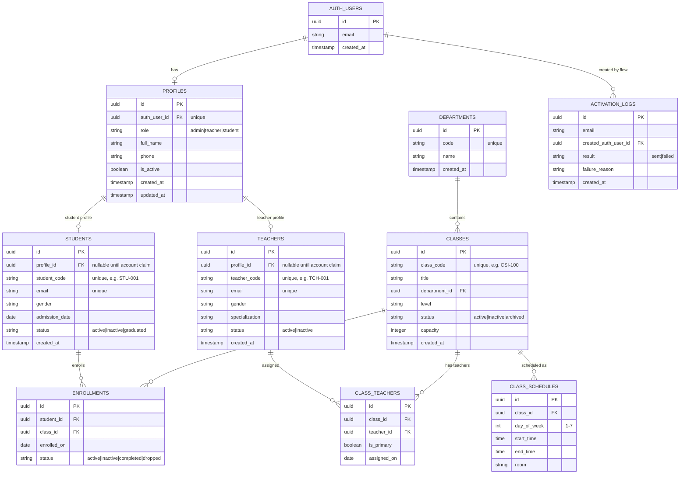

# Backend Schema (Supabase)

This schema is designed for your current modules:
- Authentication + first-time activation
- Students
- Teachers
- Classes
- Enrollments

## Visual ER Diagram



## Notes For Your Current Flow

1. User enters only email on first-time activation.
2. Edge Function creates `auth.users` account with temporary password.
3. Function sends the password to email and writes `activation_logs`.
4. On first login, user updates password and you can complete `profiles` + `students`/`teachers` linking.

## Starter SQL (Supabase/Postgres)

```sql
-- optional helper
create extension if not exists pgcrypto;

create table if not exists public.profiles (
  id uuid primary key default gen_random_uuid(),
  auth_user_id uuid unique references auth.users(id) on delete cascade,
  role text not null check (role in ('admin','teacher','student')),
  full_name text,
  phone text,
  is_active boolean not null default true,
  created_at timestamptz not null default now(),
  updated_at timestamptz not null default now()
);

create table if not exists public.students (
  id uuid primary key default gen_random_uuid(),
  profile_id uuid unique references public.profiles(id) on delete set null,
  student_code text not null unique,
  email text not null unique,
  gender text,
  admission_date date,
  status text not null default 'active' check (status in ('active','inactive','graduated')),
  created_at timestamptz not null default now()
);

create table if not exists public.teachers (
  id uuid primary key default gen_random_uuid(),
  profile_id uuid unique references public.profiles(id) on delete set null,
  teacher_code text not null unique,
  email text not null unique,
  gender text,
  specialization text,
  status text not null default 'active' check (status in ('active','inactive')),
  created_at timestamptz not null default now()
);

create table if not exists public.departments (
  id uuid primary key default gen_random_uuid(),
  code text not null unique,
  name text not null,
  created_at timestamptz not null default now()
);

create table if not exists public.classes (
  id uuid primary key default gen_random_uuid(),
  class_code text not null unique,
  title text not null,
  department_id uuid references public.departments(id) on delete set null,
  level text,
  status text not null default 'active' check (status in ('active','inactive','archived')),
  capacity int,
  created_at timestamptz not null default now()
);

create table if not exists public.class_teachers (
  id uuid primary key default gen_random_uuid(),
  class_id uuid not null references public.classes(id) on delete cascade,
  teacher_id uuid not null references public.teachers(id) on delete cascade,
  is_primary boolean not null default false,
  assigned_on date not null default current_date,
  unique(class_id, teacher_id)
);

create table if not exists public.enrollments (
  id uuid primary key default gen_random_uuid(),
  student_id uuid not null references public.students(id) on delete cascade,
  class_id uuid not null references public.classes(id) on delete cascade,
  enrolled_on date not null default current_date,
  status text not null default 'active' check (status in ('active','inactive','completed','dropped')),
  unique(student_id, class_id)
);

create table if not exists public.class_schedules (
  id uuid primary key default gen_random_uuid(),
  class_id uuid not null references public.classes(id) on delete cascade,
  day_of_week int not null check (day_of_week between 1 and 7),
  start_time time not null,
  end_time time not null,
  room text,
  check (end_time > start_time)
);

create table if not exists public.activation_logs (
  id uuid primary key default gen_random_uuid(),
  email text not null,
  created_auth_user_id uuid references auth.users(id) on delete set null,
  result text not null check (result in ('sent','failed')),
  failure_reason text,
  created_at timestamptz not null default now()
);
```
